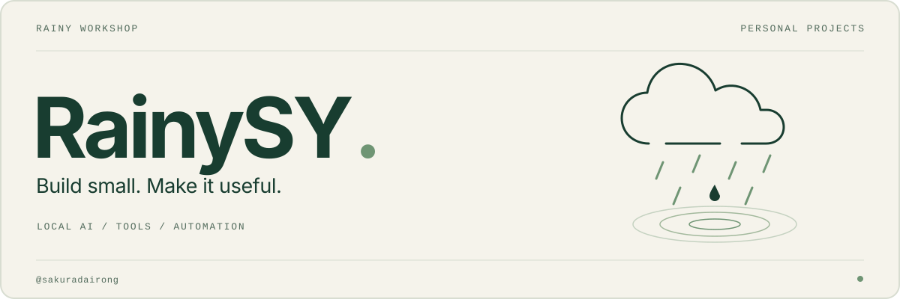

<picture>
  <source media="(prefers-color-scheme: dark)" srcset="./assets/profile-hero-dark.svg">
  <source media="(prefers-color-scheme: light)" srcset="./assets/profile-hero-light.svg">
  
</picture>

   
  <a href="https://sakuradairong.github.io">博客</a>
  &nbsp; · &nbsp;
  <a href="#selected-projects">精选</a>
  &nbsp; · &nbsp;
  <a href="#project-directory">目录</a>
  &nbsp; · &nbsp;
  <a href="https://github.com/sakuradairong?tab=repositories">仓库</a>

## 把日常的小麻烦，写成顺手的工具。

我是 **RainySY**，也就是 **@sakuradairong**。

做一些自己会用的小系统：把模型接进本地工作流，让备份和存储少些折腾，也给桌面、聊天机器人和游戏写点实用工具。偏好能落进日常的东西——少一个重复步骤，多一点顺手。

  <b>本地 AI / Agent 工作流 / 实用自动化</b> 
  Python · TypeScript · Go · Kotlin · Rust · C# · Lua · Shell · Cloudflare

 

## 精选项目 / Selected work

从模型、备份到游戏中控，挑了六个不同方向的项目。

<table>
  <tr>
    <td width="50%" valign="top">
      01 / AGENT WORKFLOW
      <h3><a href="https://github.com/sakuradairong/omp-config">omp-config ↗</a></h3>
      
把 agent 工作流整理成可复用的配置：Oh My Pi 模型覆盖、hooks 与 skills。

      
AI AGENTS · CONFIGURATION

    </td>
    <td width="50%" valign="top">
      02 / LOCAL AI
      <h3><a href="https://github.com/sakuradairong/local-fusion-gateway">local-fusion-gateway ↗</a></h3>
      
本地 OpenAI 兼容多模型融合网关，带受控的 code-research 工具。

      
MODEL GATEWAY · LOCAL TOOLS

    </td>
  </tr>
  <tr>
    <td width="50%" valign="top">
      03 / BACKUP &amp; STORAGE
      <h3><a href="https://github.com/sakuradairong/android-backup-gui">android-backup-gui ↗</a></h3>
      
给 Android 做备份与恢复，支持 restic 增量去重、WebDAV / SMB 和断点续传。

      
KOTLIN · ANDROID · RESTIC

    </td>
    <td width="50%" valign="top">
      04 / EVERYDAY TOOLS
      <h3><a href="https://github.com/sakuradairong/tiez-clipboard">tiez-clipboard ↗</a></h3>
      
基于 Tauri 的跨平台剪贴板管理器，把日常复制粘贴整理得更顺手。

      
TAURI · DESKTOP

    </td>
  </tr>
  <tr>
    <td width="50%" valign="top">
      05 / SIM &amp; PLAY
      <h3><a href="https://github.com/sakuradairong/TruckDeck">TruckDeck ↗</a></h3>
      
让手机成为 ETS2 / ATS 的横屏中控，在局域网里查看遥测、发送按键操作。

      
EXPRESS · WEBSOCKET · ETS2 / ATS

    </td>
    <td width="50%" valign="top">
      06 / CHATBOT PLUGINS
      <h3><a href="https://github.com/sakuradairong/astrbot_plugin_fishing">AstrBot Fishing ↗</a></h3>
      
给 AstrBot 加一个钓鱼互动插件，在聊天里留一点游戏时间。

      
ASTRBOT · CHAT &amp; PLAY

    </td>
  </tr>
</table>

 

## 还有一些小东西 / Project directory

按使用场景整理，展开看看。

<b>01 · AI Agents 与本地模型</b> — 配置、模型选择与网关

| 项目 | 用来做什么 |
| --- | --- |
| [omp-config](https://github.com/sakuradairong/omp-config) | Oh My Pi agent 配置、模型覆盖、hooks、skills |
| [local-fusion-gateway](https://github.com/sakuradairong/local-fusion-gateway) | 本地多模型融合网关 |
| [pi-model-selector](https://github.com/sakuradairong/pi-model-selector) | pi 的交互式模型选择扩展 |
| [pi-moa](https://github.com/sakuradairong/pi-moa) | pi / agent 相关工具 |

<b>02 · 输入法与效率</b> — 输入、剪贴板与键盘

| 项目 | 用来做什么 |
| --- | --- |
| [rime-config](https://github.com/sakuradairong/rime-config) | 基于雾凇拼音的个人 Rime 配置 |
| [rime-lua-scripts](https://github.com/sakuradairong/rime-lua-scripts) | 个人 Rime Lua 脚本 |
| [tiez-clipboard](https://github.com/sakuradairong/tiez-clipboard) | Tauri 跨平台剪贴板管理器 |
| [keystats-heatmap](https://github.com/sakuradairong/keystats-heatmap) | 3D 键盘使用热力图 |

<b>03 · Android、备份与存储</b> — 数据的整理与安放

| 项目 | 用来做什么 |
| --- | --- |
| [android-backup-gui](https://github.com/sakuradairong/android-backup-gui) | Kotlin Android 备份恢复 GUI |
| [backup_script](https://github.com/sakuradairong/backup_script) | 支持远程存储的备份脚本 |
| [samba](https://github.com/sakuradairong/samba) | Samba Android arm64 静态构建产物 |
| [normalize-filenames](https://github.com/sakuradairong/normalize-filenames) | 清理 NFD / NFC 文件名重复 |

<b>04 · 聊天机器人</b> — 互动、查询与链接预览

| 项目 | 用来做什么 |
| --- | --- |
| [astrbot_plugin_fishing](https://github.com/sakuradairong/astrbot_plugin_fishing) | AstrBot 钓鱼互动插件 |
| [astrbot_plugin_pubg](https://github.com/sakuradairong/astrbot_plugin_pubg) | AstrBot PUBG 战绩查询 |
| [astrbot_plugin_Gitparser](https://github.com/sakuradairong/astrbot_plugin_Gitparser) | GitHub 仓库解析与事件通知 |
| [astrbot_plugin_linuxdo](https://github.com/sakuradairong/astrbot_plugin_linuxdo) | linux.do 链接预览与截图 |
| [astrbot-plugin-linuxsb](https://github.com/sakuradairong/astrbot-plugin-linuxsb) | linux.sb 论坛帖子预览 |
| [astrbot-plugin-dev](https://github.com/sakuradairong/astrbot-plugin-dev) | AstrBot 插件开发工作区 |

<b>05 · 桌面与游戏</b> — 日常小工具，也有兴趣使然

| 项目 | 用来做什么 |
| --- | --- |
| [TruckDeck](https://github.com/sakuradairong/TruckDeck) | ETS2 / ATS 遥测与按键注入手机中控 |
| [7dtd-server-manager](https://github.com/sakuradairong/7dtd-server-manager) | 七日杀专用服管理（Telnet / RCON） |
| [XUnity.AutoTranslator.AIUniversal](https://github.com/sakuradairong/XUnity.AutoTranslator.AIUniversal) | 游戏 AI 翻译插件（OpenAI 兼容 API） |
| [bilidesk](https://github.com/sakuradairong/bilidesk) | B 站 Windows 桌面客户端（自用） |
| [minimaximage](https://github.com/sakuradairong/minimaximage) | Minimax 图像生成 CLI / GUI |
| [OfficeTap](https://github.com/sakuradairong/OfficeTap) | Excel VSTO 工作簿标签任务窗格 |
| [office-data-matcher](https://github.com/sakuradairong/office-data-matcher) | Office 数据匹配工具 |
| [go-123pan-pic](https://github.com/sakuradairong/go-123pan-pic) | 123 盘图片上传 CLI |

<b>06 · Web、Cloud 与个人基础设施</b> — 服务、脚本与自己的角落

| 项目 | 用来做什么 |
| --- | --- |
| [smartstrm-cleanroom](https://github.com/sakuradairong/smartstrm-cleanroom) | Go 实现的 STRM 自动化服务 |
| [r2-explorer-template](https://github.com/sakuradairong/r2-explorer-template) | Cloudflare R2 文件浏览器模板 |
| [SubConverter-Extended](https://github.com/sakuradairong/SubConverter-Extended) | 基于 Aethersailor/SubConverter-Extended 的扩展构建 |
| [typix](https://github.com/sakuradairong/typix) | TypeScript 工具集 |
| [deepseek-monitor](https://github.com/sakuradairong/deepseek-monitor) | DeepSeek API 状态监控 |
| [sakuradairong.github.io](https://github.com/sakuradairong/sakuradairong.github.io) | GitHub Pages 博客 |
| [picture](https://github.com/sakuradairong/picture) | 个人图床仓库 |

 

---

  <b>小而有用，慢慢打磨。</b> 
  RainySY · <a href="https://sakuradairong.github.io">写点东西</a> · <a href="https://github.com/RainySY">旧账号 @RainySY</a>

